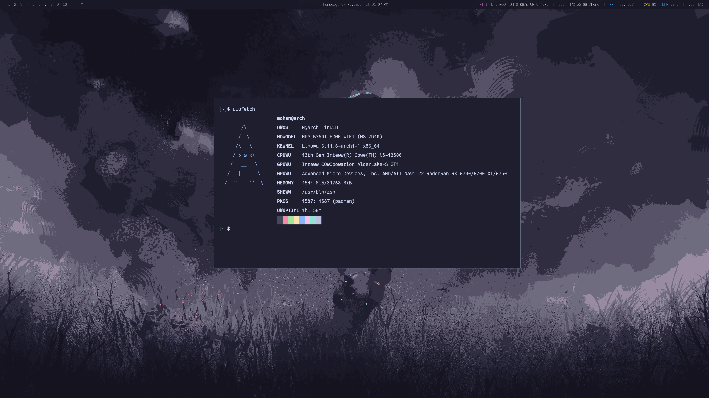

# Screenshots



# Installation
## Stow
Used for managing the configuration
```bash
sudo pamcan -S stow
```
## Stow Mac

```bash
brew install stow
```

### Create Symlinks
Places the files in their respective locations by creating symlinks
```bash
$ stow .
```
### Adding new files
1. Copy the file/directory in this directory making sure the path is same as from `parent` directory. For example adding `~/.config/mpv` copy it to `.config/mpv` of this repository
2. Rename the original file/directory just in case.
3. run `stow .` in this directory it should create the symlink

## Packages (Arch)
### Install AUR packages
```bash
yay -S $(cat aur-packages.txt)
```
### Install pacman packages
``` bash
pacman -S $(cat pacman-pkgs.txt)
```

### Create packages backup
#### Pacman
```bash
pacman -Qeqn > pacman-pkgs.txt
```
#### AUR
```bash
pacman -Qemq > aur-packages.lst
```
